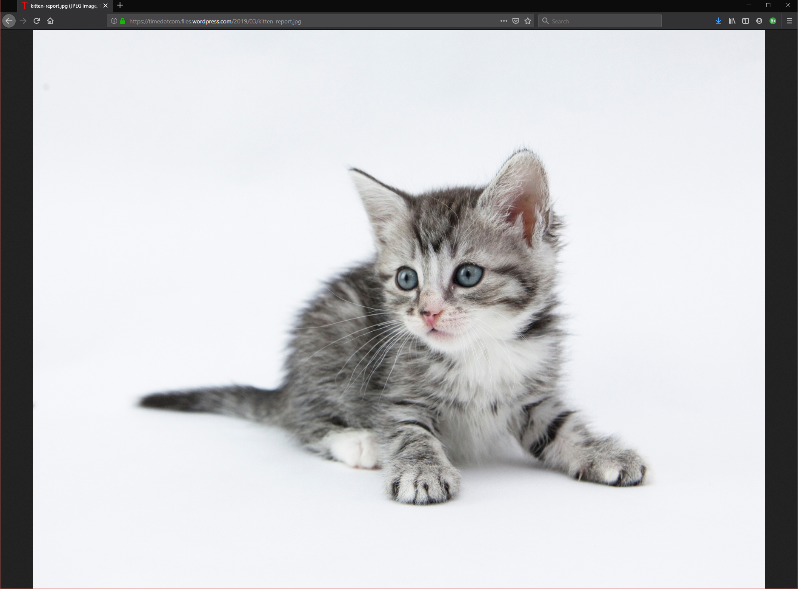
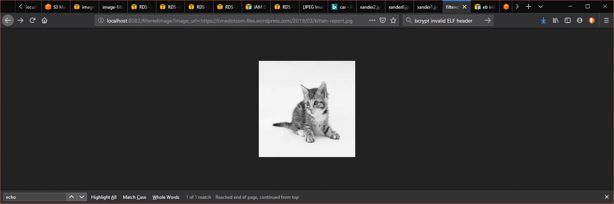

# Udagram Image Filtering Microservice

Scott Hwang
2019-08-14

This code is for a project requirement of the Udacity Cloud Developer Nanodegree course. Most of the code was provided. Students were tasked to create a new RESTful endpoint which takes a URL for an image on the Web, filters it, and returns the filtered image. The original copy is deleted from the server.

The code has been deployed to AWS Elastic Beanstalk at URL:

`https:\\image-filter-dev-dev.us-east-1.elasticbeanstalk.com`

## Instructions to Filter Images

To filter an image, enter the endpoint in your internet browser with the following format:

http://image-filter-dev-dev.us-east-1.elasticbeanstalk.com/filteredimage/?image_url={URL}

For example
If the original image is at the following URL:

https://timedotcom.files.wordpress.com/2019/03/kitten-report.jpg

Enter the following in your browser to filter it:
http://image-filter-dev-dev.us-east-1.elasticbeanstalk.com/filteredimage/?image_url=https://timedotcom.files.wordpress.com/2019/03/kitten-report.jpg

The returned filtered image looks like:

